# Project Presentation Walkthrough

A concise visual walkthrough of the Urban Air Quality Index & Pollutant Drift Analysis project, covering the research problem, data engineering, statistical methodology, machine learning, deployment, conclusions and supporting references.

---

## Presentation Overview

- **Slide Deck:** 12 authoritative presentation slides
- **Course Framework:** Statistics for Machine Learning — Project Based Learning
- **Institution:** Geethanjali College of Engineering and Technology &bull; B.Tech CSE (AIML)
- **Baseline Invariant:** Scientific evaluation frozen at `v0.6-svm-freeze` (March 1, 2025 to September 21, 2026)
- **Operational Status:** Live data extension enabled separately via GitHub Actions (`v0.7.3-live-extension`)
- **Review Audience:** Faculty review, external evaluation, and technical project defense

> [!NOTE]
> **Faculty Reviewer Note:** This presentation summarizes the frozen academic analysis while demonstrating the separately maintained operational data extension. All statistical inferences, distribution tests, hypothesis evaluations, and machine-learning models remain strictly tied to the frozen scientific baseline (`v0.6-svm-freeze`). Periodic operational updates do not alter or retrain the published academic metrics.

---

## Presentation Contents

<nav class="presentation-index" aria-label="Presentation Slide Index">
  
📑 Quick-Jump Slide Index

  <ul class="presentation-index__grid">
    <li class="presentation-index__item">
      <a href="#slide-1" class="presentation-index__link">
        01.
        Urban Air Quality Index &amp; Pollutant Drift Analysis
      </a>
    </li>
    <li class="presentation-index__item">
      <a href="#slide-2" class="presentation-index__link">
        02.
        Problem Statement &amp; Motivation
      </a>
    </li>
    <li class="presentation-index__item">
      <a href="#slide-3" class="presentation-index__link">
        03.
        Objectives &amp; Scope
      </a>
    </li>
    <li class="presentation-index__item">
      <a href="#slide-4" class="presentation-index__link">
        04.
        Data Sources &amp; Study Design
      </a>
    </li>
    <li class="presentation-index__item">
      <a href="#slide-5" class="presentation-index__link">
        05.
        Data Pipeline &amp; Preprocessing
      </a>
    </li>
    <li class="presentation-index__item">
      <a href="#slide-6" class="presentation-index__link">
        06.
        AQI Methodology &amp; Statistical Foundation
      </a>
    </li>
    <li class="presentation-index__item">
      <a href="#slide-7" class="presentation-index__link">
        07.
        Exploratory Results / Key Observations
      </a>
    </li>
    <li class="presentation-index__item">
      <a href="#slide-8" class="presentation-index__link">
        08.
        Machine Learning Approach
      </a>
    </li>
    <li class="presentation-index__item">
      <a href="#slide-9" class="presentation-index__link">
        09.
        Model Results &amp; Interpretation
      </a>
    </li>
    <li class="presentation-index__item">
      <a href="#slide-10" class="presentation-index__link">
        10.
        Website Features &amp; System Demonstration
      </a>
    </li>
    <li class="presentation-index__item">
      <a href="#slide-11" class="presentation-index__link">
        11.
        References / Terminology
      </a>
    </li>
    <li class="presentation-index__item">
      <a href="#slide-12" class="presentation-index__link">
        12.
        Thank You
      </a>
    </li>
  </ul>
</nav>

---

## Slides &amp; Analytical Walkthrough

  <!-- Slide 01 -->
  <article class="presentation-slide" id="slide-1">
    

      Slide 01
      <h3 class="presentation-slide__title">Urban Air Quality Index &amp; Pollutant Drift Analysis</h3>
    

    <figure class="presentation-slide__figure">
      <picture>
        <source srcset="../slides/web/slide01.webp" type="image/webp">
        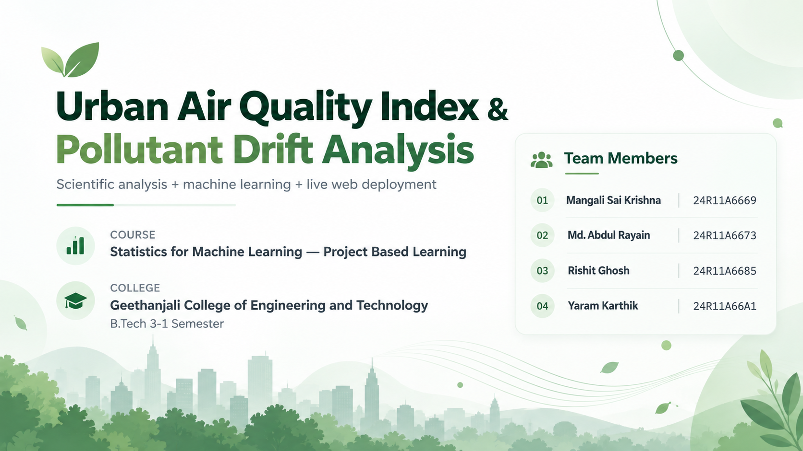
      </picture>
      <figcaption class="presentation-slide__caption">
        
<strong>Purpose:</strong> Formal title and metadata slide identifying the investigation as a semester-long project for Statistics for Machine Learning &mdash; Project Based Learning at Geethanjali College of Engineering and Technology.

        
<strong>Key Idea:</strong> Unifies physical sensor data engineering, statistical drift diagnostics, supervised regression/classification, nonlinear support vector machines, and live web deployment under a single reproducible architecture.

      </figcaption>
    </figure>
    

      <a href="../slides/slide1.png" target="_blank" rel="noopener noreferrer" class="presentation-slide__full-link" title="Open master resolution PNG in new tab">🔍 Open Full-Size Slide (Original Master PNG)</a>
    

  </article>

  <!-- Slide 02 -->
  <article class="presentation-slide" id="slide-2">
    

      Slide 02
      <h3 class="presentation-slide__title">Problem Statement &amp; Motivation</h3>
    

    <figure class="presentation-slide__figure">
      <picture>
        <source srcset="../slides/web/slide02.webp" type="image/webp">
        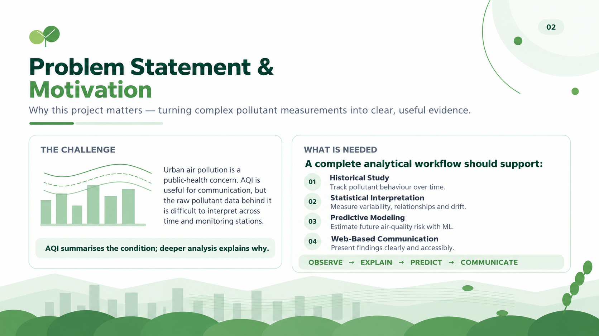
      </picture>
      <figcaption class="presentation-slide__caption">
        
<strong>Purpose:</strong> Formulates the core motivation: while regulatory AQI communicates general health severity, the complex physical mass concentrations and meteorological interactions behind it require deeper statistical explanation.

        
<strong>Key Idea:</strong> Introduces the project's analytical doctrine &mdash; <em>Observe &rarr; Explain &rarr; Predict &rarr; Communicate</em> &mdash; transforming fragmented sensor streams into an end-to-end evidence pipeline.

      </figcaption>
    </figure>
    

      <a href="../slides/slide2.png" target="_blank" rel="noopener noreferrer" class="presentation-slide__full-link" title="Open master resolution PNG in new tab">🔍 Open Full-Size Slide (Original Master PNG)</a>
    

  </article>

  <!-- Slide 03 -->
  <article class="presentation-slide" id="slide-3">
    

      Slide 03
      <h3 class="presentation-slide__title">Objectives &amp; Scope</h3>
    

    <figure class="presentation-slide__figure">
      <picture>
        <source srcset="../slides/web/slide03.webp" type="image/webp">
        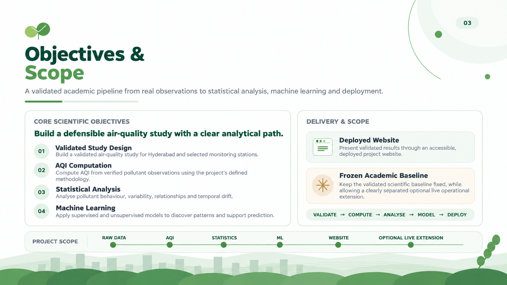
      </picture>
      <figcaption class="presentation-slide__caption">
        
<strong>Purpose:</strong> Defines the scientific boundaries and deliverables: rigorous study design, AQI calculation, statistical inference, and machine learning models presented through a production web application.

        
<strong>Key Idea:</strong> Clearly demarcates the 570-day frozen scientific baseline from the optional operational live extension, guaranteeing that academic evaluation remains fixed and reproducible.

      </figcaption>
    </figure>
    

      <a href="../slides/slide3.png" target="_blank" rel="noopener noreferrer" class="presentation-slide__full-link" title="Open master resolution PNG in new tab">🔍 Open Full-Size Slide (Original Master PNG)</a>
    

  </article>

  <!-- Slide 04 -->
  <article class="presentation-slide" id="slide-4">
    

      Slide 04
      <h3 class="presentation-slide__title">Data Sources &amp; Study Design</h3>
    

    <figure class="presentation-slide__figure">
      <picture>
        <source srcset="../slides/web/slide04.webp" type="image/webp">
        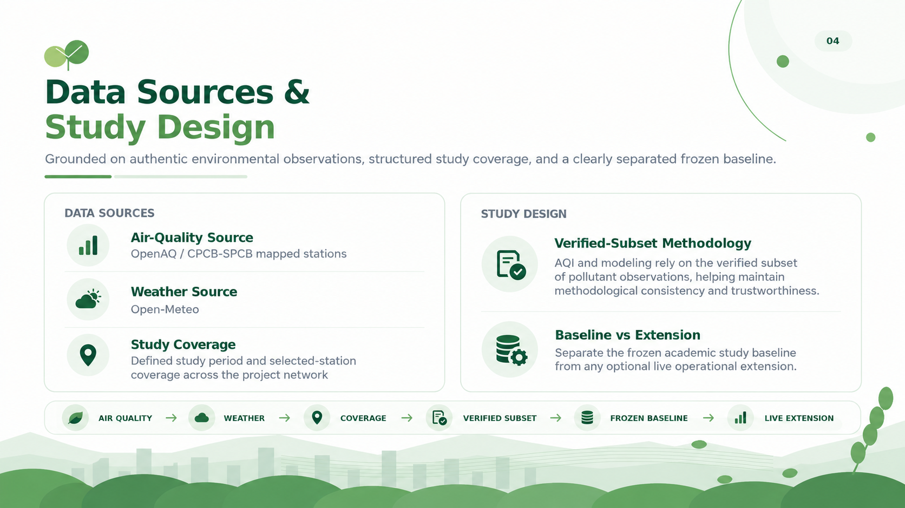
      </picture>
      <figcaption class="presentation-slide__caption">
        
<strong>Purpose:</strong> Details data acquisition sources (OpenAQ v3 physical CAAQMS stations and Open-Meteo hourly meteorology) across 21 selected stations spanning Hyderabad and the India Representative Panel.

        
<strong>Key Idea:</strong> Establishes the verified-subset methodology (computing AQI only from verified pollutant observations) and formalizes the separation between frozen academic datasets and operational streaming data.

      </figcaption>
    </figure>
    

      <a href="../slides/slide4.png" target="_blank" rel="noopener noreferrer" class="presentation-slide__full-link" title="Open master resolution PNG in new tab">🔍 Open Full-Size Slide (Original Master PNG)</a>
    

  </article>

  <!-- Slide 05 -->
  <article class="presentation-slide" id="slide-5">
    

      Slide 05
      <h3 class="presentation-slide__title">Data Pipeline &amp; Preprocessing</h3>
    

    <figure class="presentation-slide__figure">
      <picture>
        <source srcset="../slides/web/slide05.webp" type="image/webp">
        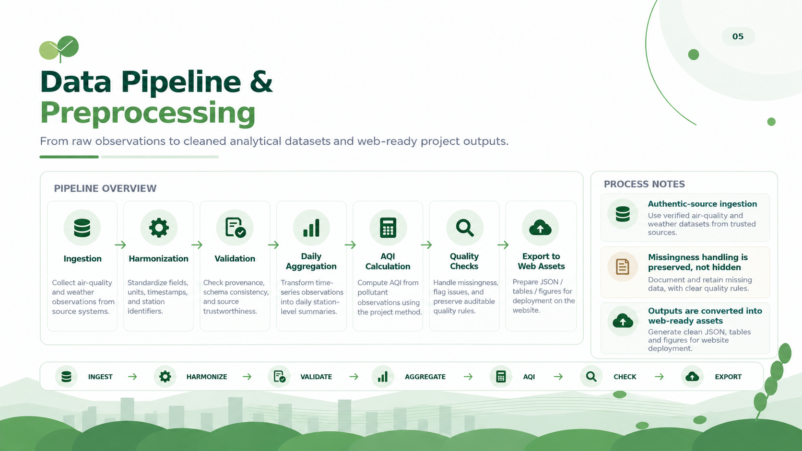
      </picture>
      <figcaption class="presentation-slide__caption">
        
<strong>Purpose:</strong> Traces the sequential data engineering lifecycle: Ingestion &rarr; Harmonization &rarr; Validation &rarr; Daily Aggregation &rarr; AQI Calculation &rarr; Quality Checks &rarr; Web Export.

        
<strong>Key Idea:</strong> Emphasizes honest missingness handling &mdash; missing observations are recorded, audited, and preserved rather than artificially fabricated or imputed.

      </figcaption>
    </figure>
    

      <a href="../slides/slide5.png" target="_blank" rel="noopener noreferrer" class="presentation-slide__full-link" title="Open master resolution PNG in new tab">🔍 Open Full-Size Slide (Original Master PNG)</a>
    

  </article>

  <!-- Slide 06 -->
  <article class="presentation-slide" id="slide-6">
    

      Slide 06
      <h3 class="presentation-slide__title">AQI Methodology &amp; Statistical Foundation</h3>
    

    <figure class="presentation-slide__figure">
      <picture>
        <source srcset="../slides/web/slide06.webp" type="image/webp">
        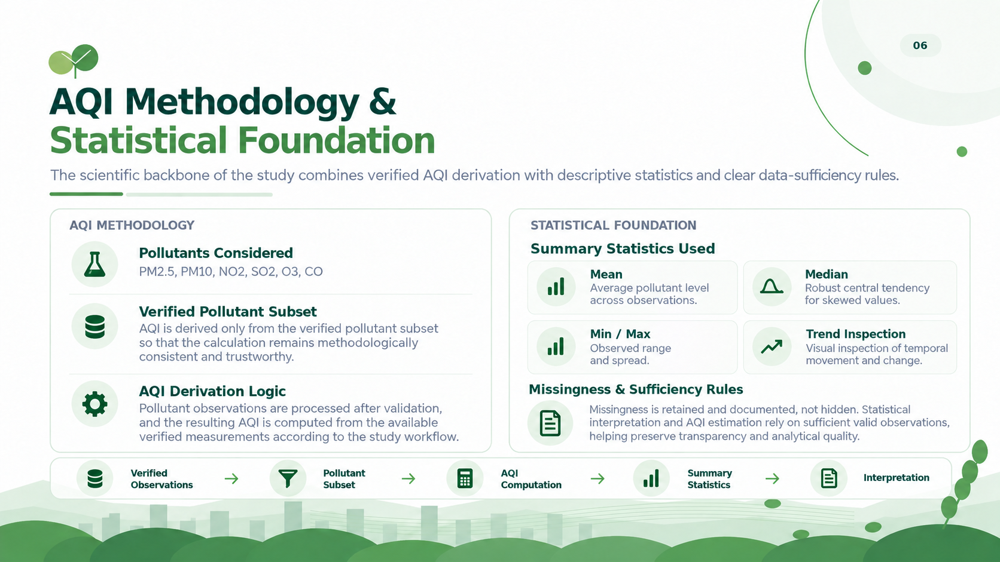
      </picture>
      <figcaption class="presentation-slide__caption">
        
<strong>Purpose:</strong> Presents the regulatory subindex interpolation rules (CPCB linear breakpoints) and core statistical summary measures (Mean, Median, Min/Max, and trend analysis).

        
<strong>Key Idea:</strong> Implements the CPCB 16-hour completion rule and data sufficiency constraints to ensure all computed subindices and composite AQI values satisfy strict regulatory standards.

      </figcaption>
    </figure>
    

      <a href="../slides/slide6.png" target="_blank" rel="noopener noreferrer" class="presentation-slide__full-link" title="Open master resolution PNG in new tab">🔍 Open Full-Size Slide (Original Master PNG)</a>
    

  </article>

  <!-- Slide 07 -->
  <article class="presentation-slide" id="slide-7">
    

      Slide 07
      <h3 class="presentation-slide__title">Exploratory Results / Key Observations</h3>
    

    <figure class="presentation-slide__figure">
      <picture>
        <source srcset="../slides/web/slide07.webp" type="image/webp">
        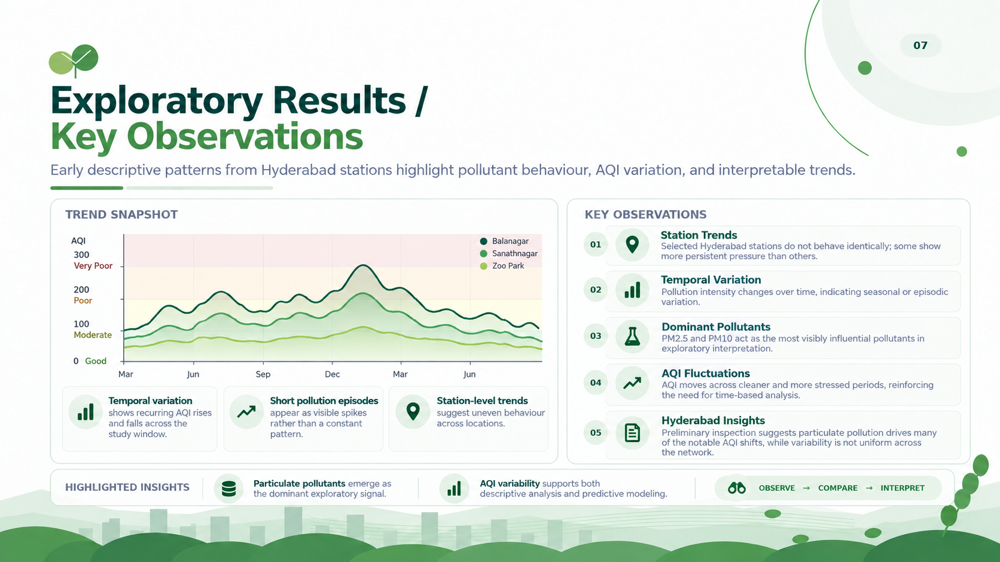
      </picture>
      <figcaption class="presentation-slide__caption">
        
<strong>Purpose:</strong> Highlights descriptive patterns, multi-station temporal trajectories, and episodic spikes across Hyderabad monitoring stations (Balanagar, Sanathnagar, Zoo Park).

        
<strong>Key Idea:</strong> Shows that fine particulate matter (PM2.5 and PM10) acts as the dominant exploratory driver of AQI variance, displaying strong seasonal winter elevation and uneven station-level pressure.

      </figcaption>
    </figure>
    

      <a href="../slides/slide7.png" target="_blank" rel="noopener noreferrer" class="presentation-slide__full-link" title="Open master resolution PNG in new tab">🔍 Open Full-Size Slide (Original Master PNG)</a>
    

  </article>

  <!-- Slide 08 -->
  <article class="presentation-slide" id="slide-8">
    

      Slide 08
      <h3 class="presentation-slide__title">Machine Learning Approach</h3>
    

    <figure class="presentation-slide__figure">
      <picture>
        <source srcset="../slides/web/slide08.webp" type="image/webp">
        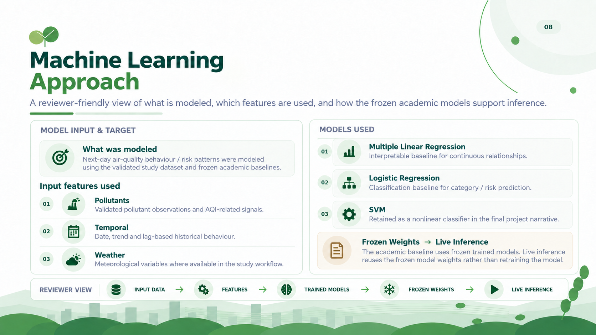
      </picture>
      <figcaption class="presentation-slide__caption">
        
<strong>Purpose:</strong> Explains target variables, feature design (pollutants, calendar lag features, meteorology), and the complementary model suite: Multiple Linear Regression, Logistic Regression, and Support Vector Machines.

        
<strong>Key Idea:</strong> Clarifies that operational scoring reuses frozen model weights for deterministic inference rather than executing uncontrolled daily retraining.

      </figcaption>
    </figure>
    

      <a href="../slides/slide8.png" target="_blank" rel="noopener noreferrer" class="presentation-slide__full-link" title="Open master resolution PNG in new tab">🔍 Open Full-Size Slide (Original Master PNG)</a>
    

  </article>

  <!-- Slide 09 -->
  <article class="presentation-slide" id="slide-9">
    

      Slide 09
      <h3 class="presentation-slide__title">Model Results &amp; Interpretation</h3>
    

    <figure class="presentation-slide__figure">
      <picture>
        <source srcset="../slides/web/slide09.webp" type="image/webp">
        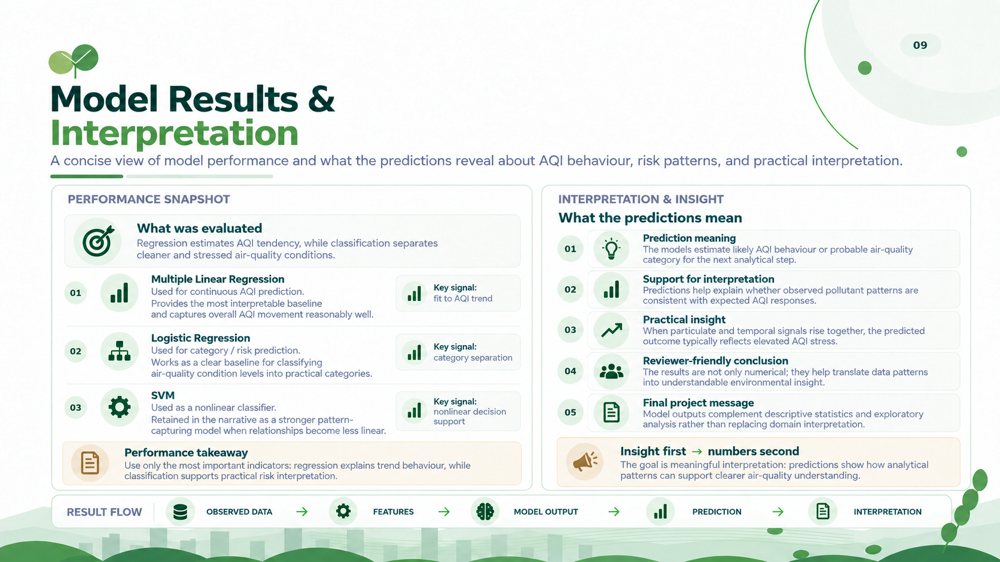
      </picture>
      <figcaption class="presentation-slide__caption">
        
<strong>Purpose:</strong> Evaluates out-of-sample performance: Multiple Linear Regression for continuous trend fitting, Logistic Regression for adverse event probability ranking, and RBF SVM for nonlinear decision boundary separation.

        
<strong>Key Idea:</strong> Emphasizes <em>insight first &rarr; numbers second</em> &mdash; models serve to illuminate the atmospheric physics and persistence dynamics rather than acting as uninterpretable black boxes.

      </figcaption>
    </figure>
    

      <a href="../slides/slide9.png" target="_blank" rel="noopener noreferrer" class="presentation-slide__full-link" title="Open master resolution PNG in new tab">🔍 Open Full-Size Slide (Original Master PNG)</a>
    

  </article>

  <!-- Slide 10 -->
  <article class="presentation-slide" id="slide-10">
    

      Slide 10
      <h3 class="presentation-slide__title">Website Features &amp; System Demonstration</h3>
    

    <figure class="presentation-slide__figure">
      <picture>
        <source srcset="../slides/web/slide10.webp" type="image/webp">
        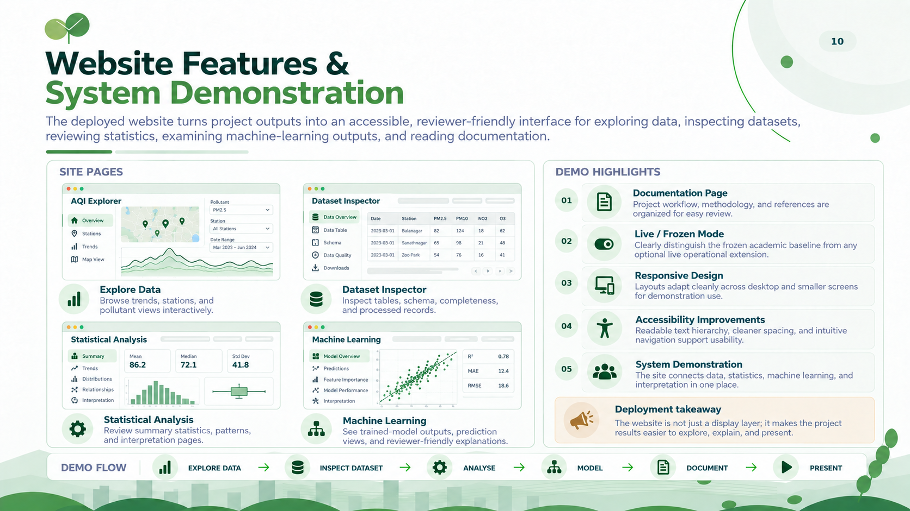
      </picture>
      <figcaption class="presentation-slide__caption">
        
<strong>Purpose:</strong> Demonstrates the publicly deployed web application: Explore Data, Dataset Inspector, Statistical Analysis, Machine Learning, and Documentation.

        
<strong>Key Idea:</strong> Highlights key architectural features: zero-runtime frontend, live vs. frozen data mode switching, WCAG AA accessibility, and fully responsive layouts across mobile and desktop devices.

      </figcaption>
    </figure>
    

      <a href="../slides/slide10.png" target="_blank" rel="noopener noreferrer" class="presentation-slide__full-link" title="Open master resolution PNG in new tab">🔍 Open Full-Size Slide (Original Master PNG)</a>
    

  </article>

  <!-- Slide 11 -->
  <article class="presentation-slide" id="slide-11">
    

      Slide 11
      <h3 class="presentation-slide__title">References / Terminology</h3>
    

    <figure class="presentation-slide__figure">
      <picture>
        <source srcset="../slides/web/slide11.webp" type="image/webp">
        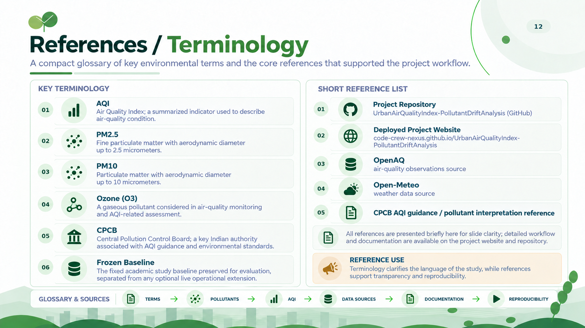
      </picture>
      <figcaption class="presentation-slide__caption">
        
<strong>Purpose:</strong> Consolidates core regulatory terminology (AQI, PM2.5, PM10, O3, CPCB, Frozen Baseline) alongside primary data sources (OpenAQ, Open-Meteo) and technical references.

        
<strong>Key Idea:</strong> Ensures conceptual precision and complete provenance across all environmental metrics, regulatory standards, and scientific citations.

      </figcaption>
    </figure>
    

      <a href="../slides/slide11.png" target="_blank" rel="noopener noreferrer" class="presentation-slide__full-link" title="Open master resolution PNG in new tab">🔍 Open Full-Size Slide (Original Master PNG)</a>
    

  </article>

  <!-- Slide 12 -->
  <article class="presentation-slide" id="slide-12">
    

      Slide 12
      <h3 class="presentation-slide__title">Thank You</h3>
    

    <figure class="presentation-slide__figure">
      <picture>
        <source srcset="../slides/web/slide12.webp" type="image/webp">
        
      </picture>
      <figcaption class="presentation-slide__caption">
        
<strong>Purpose:</strong> Formal closing slide acknowledging faculty mentors, peers, and evaluators, and inviting questions and technical discussion.

        
<strong>Key Idea:</strong> Concludes the presentation walkthrough and directs evaluators to the public repository, live website, and interactive data explorer for real-time demonstration.

      </figcaption>
    </figure>
    

      <a href="../slides/slide12.png" target="_blank" rel="noopener noreferrer" class="presentation-slide__full-link" title="Open master resolution PNG in new tab">🔍 Open Full-Size Slide (Original Master PNG)</a>
    

  </article>

