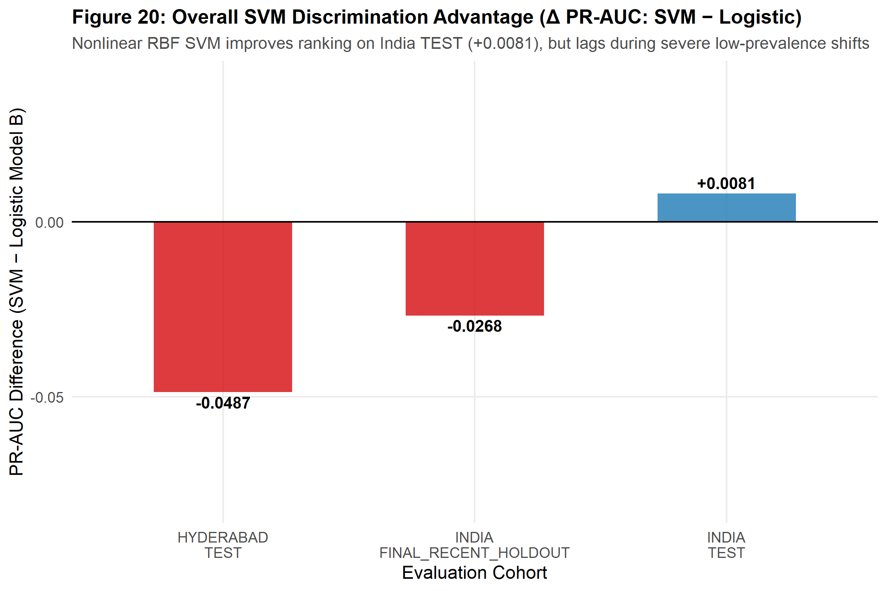
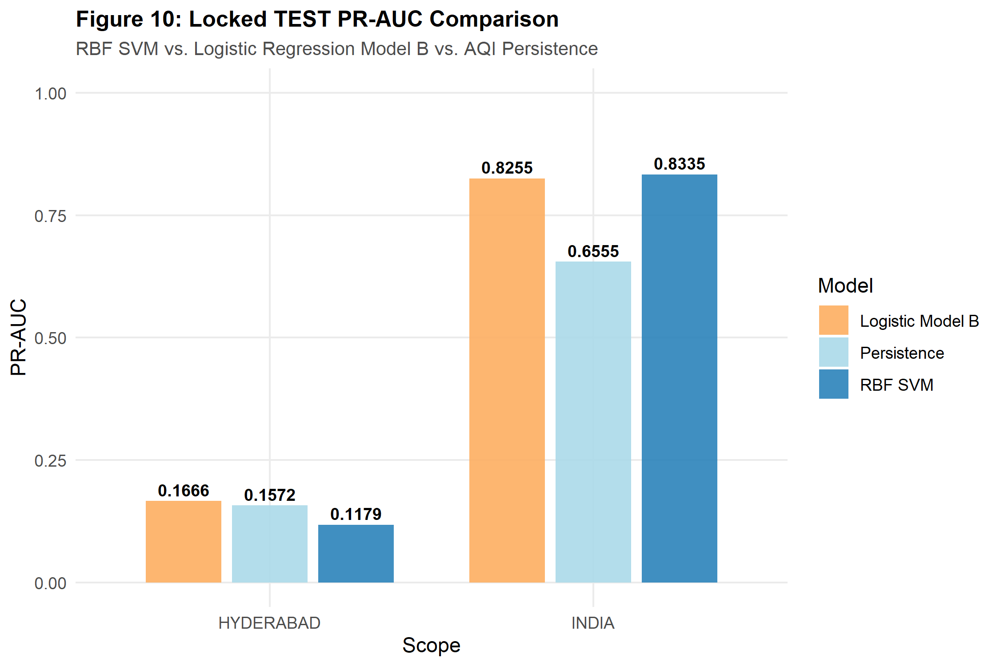
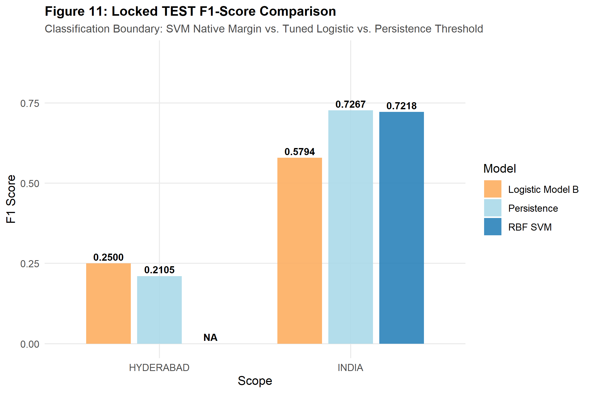
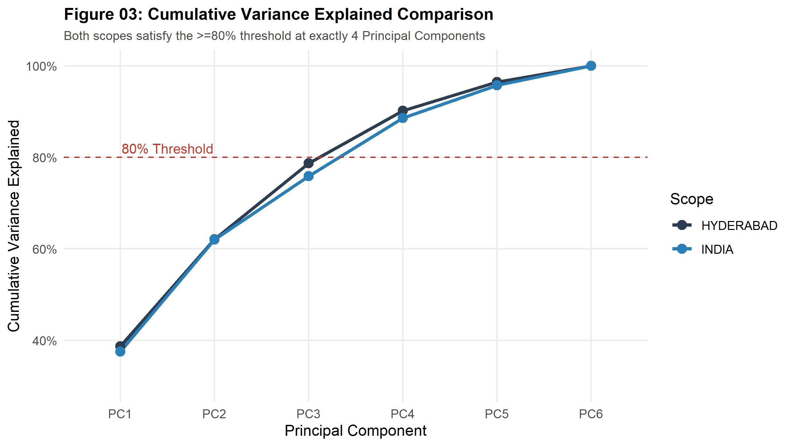
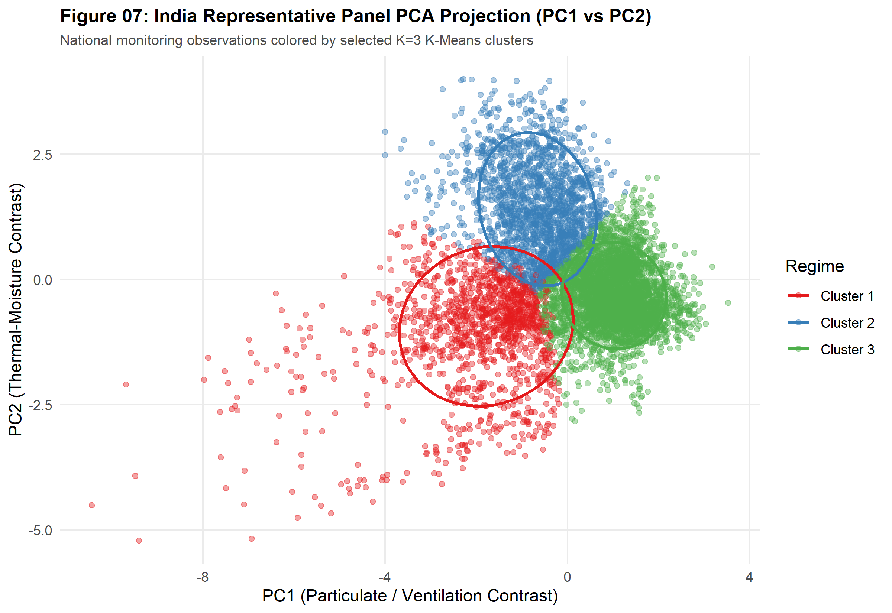
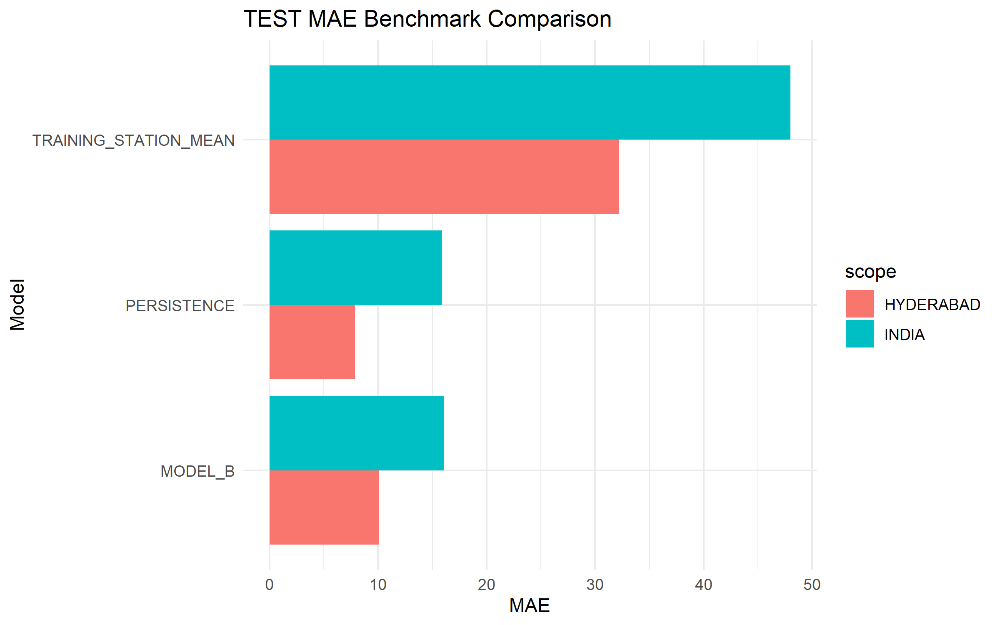
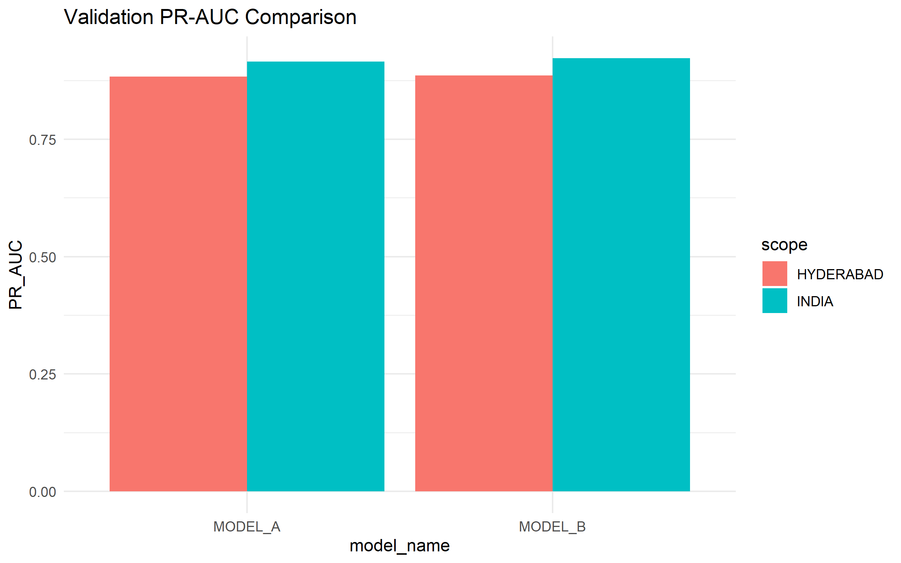

# Scientific Figures & Artifact Samples

**Project:** `UrbanAirQualityIndex-PollutantDriftAnalysis`  
**Course:** Statistics for Machine Learning (SML) — Project Based Learning (PBL)  
**Organization:** `Code-Crew-Nexus`  
**Curated Source:** `docs/figures/`

---

## 1. Overview of Curated Figures

This indexed gallery showcases key graphical artifacts produced across the scientific phases of the project. Each figure is generated deterministically by R scripts using frozen datasets and locked random seeds.

---

## 2. Nonlinear Support Vector Machine (Phase 5B)

### Overall SVM vs. Logistic vs. Persistence Benchmarking
Comprehensive metric summary comparing RBF SVM against frozen Logistic Model B and simple persistence on the locked out-of-sample TEST split.

- **Script:** `scripts/20d_phase5B_figures.R`
- **Key Takeaway:** On the India Representative Panel, RBF SVM achieved superior PR-AUC ($0.8335$ vs. $0.8255$) and elevated native hard-classification $F_1$ to $0.7218$, rivaling persistence ($0.7267$).

---

### Out-of-Sample Test PR-AUC Comparison
Precision-Recall Area Under the Curve on locked test observations ($N=477$ Hyderabad, $N=1,389$ India).

- **Script:** `scripts/20d_phase5B_figures.R`
- **Key Takeaway:** SVM established higher PR-AUC event ranking on the diverse national panel, but experienced sensitivity limitations in Hyderabad where test-period adverse prevalence was only $2.3\%$.

---

### Out-of-Sample Test $F_1$ Score Comparison
Native hard-classification $F_1$ performance across model families.

- **Script:** `scripts/20d_phase5B_figures.R`
- **Key Takeaway:** Demonstrates the impact of class imbalance on native unweighted margin separation versus persistence.

---

## 3. Unsupervised Dimensionality & Regime Discovery (Phase 5A)

### Cumulative Variance Explained by Principal Components
Comparison of eigenvalues and cumulative variance explained by the 6 orthogonal principal axes across Hyderabad and India monitoring panels.

- **Script:** `scripts/18c_phase5A_profiles_figures.R`
- **Key Takeaway:** The first 4 principal components capture **90.21% (Hyderabad)** and **88.65% (India)** of multi-sensor variance, confirming that urban atmospheric dynamics compress into a low-dimensional orthogonal subspace.

---

### Biplot Projection: PC1 vs. PC2 by $K$-Means Cluster (India Representative Panel)
Two-dimensional projection of multi-station observations onto the particulate/ventilation (PC1) and thermal-moisture (PC2) axes, color-coded by the 3 selected pollution regimes.

- **Script:** `scripts/18c_phase5A_profiles_figures.R`
- **Key Takeaway:** Partitions multi-station observations into 3 selected regimes (`cool-low-wind-particulate-elevated`, `hot-dry-ozone-pm10-elevated`, and `humid-windy-lower-pollution`). Cluster labels are descriptive regime summaries and do not identify atmospheric chemical mechanisms or pollutant sources.

---

## 4. Supervised Linear & Logistic Baselines (Phase 4)

### Locked Test Mean Absolute Error (MAE) Comparison
Continuous next-day AQI prediction error comparing MLR Model A (persistence-free), MLR Model B (persistence-aware), and naive single-day persistence.

- **Script:** `scripts/14c_phase4B_figures.R`
- **Key Takeaway:** Persistence-aware Model B significantly improves upon Model A, but simple single-day persistence remains a formidable baseline during high-inertia seasonal blocks.

---

### Logistic Model Validation PR-AUC Comparison
Precision-Recall curves comparing candidate logistic regression model specifications across validation folds.

- **Script:** `scripts/15c_phase4C_figures.R`
- **Key Takeaway:** Logistic Model B (including day-$t$ AQI) consistently outperforms meteorology-only specifications for adverse-event ranking.
