# Project Methodology and Architecture

**Project:** UrbanAirQualityIndex-PollutantDriftAnalysis  
**Academic Context:** B.Tech CSE (AI & ML) III Year / I Sem — Statistics for Machine Learning (PBL)  

---

## 1. Pedagogical Overview
This project is engineered for undergraduate students in Computer Science & Engineering (Artificial Intelligence and Machine Learning). The design prioritizes **transparency, reproducibility, statistical correctness, and viva-explainability** over excessive software engineering abstractions.

Rather than relying on black-box libraries or monolithic scripts, the architecture separates data acquisition, data quality auditing, canonical harmonization, and eventual statistical modeling into distinct, inspectable phases.

```mermaid
flowchart TD
    subgraph Phase0 ["Phase 0: Project Scaffolding (COMPLETE)"]
        P0_Cfg["Project Config & Dictionaries"]
        P0_Dir["Directory Tree & Standards"]
    end

    subgraph Phase1 ["Phase 1: Foundation & Audit (COMPLETE)"]
        P1_Disc["Station Discovery\n(Hyderabad & India Cities)"]
        P1_Aud["Data Availability & Completeness Audit"]
        P1_Samp["Small-Scale Ingestion Test\n(Air Quality & Weather)"]
        P1_Rep["Quarto Audit Report\n(analysis/01_data_audit.qmd)"]
    end

    subgraph Phase2 ["Phase 2: Canonical Datasets (FROZEN)"]
        P2_Hist["Historical Acquisition & Normalization\n(Frozen 2025-03 to 2026-09)"]
        P2_Pre["Pre-AQI Daily Dataset Engineering"]
        P2_AQI["Verified-Subset CPCB AQI Calculation"]
        P2_Out["Export: UAQI_Master_Daily.csv\n& Regional Subsets"]
    end

    subgraph Phase3 ["Phase 3: Statistics & Drift (FROZEN)"]
        P3_EDA["Descriptive Statistics & Normality"]
        P3_Drift["Pollutant Drift (Standardized Mean Shift)"]
        P3_Hyp["Moving-Block Bootstrap Inference"]
    end

    subgraph Phase4 ["Phase 4: Supervised Learning (FROZEN: v0.4)"]
        P4_MLR["Multiple Linear Regression (Continuous Next-Day AQI)"]
        P4_Log["Logistic Regression (Adverse AQI_(t+1) > 100)"]
    end

    subgraph Phase5 ["Phase 5: Unsupervised & SVM (FROZEN: v0.5 & v0.6)"]
        P5_Unsup["PCA (4 PCs) & K-Means (k=3 Regimes)"]
        P5_SVM["RBF Kernel SVM Classification"]
    end

    subgraph Phase6 ["Phase 6: Static Project Website (IN DEVELOPMENT)"]
        P6_Web["HTML5 / CSS3 / Vanilla JS on GitHub Pages"]
    end

    Phase0 --> Phase1
    Phase1 --> Phase2
    Phase2 --> Phase3
    Phase3 --> Phase4
    Phase4 --> Phase5
    Phase5 --> Phase6
```

---

## 2. Phase 0: Scaffolding and Standards
1. **Structure:** Clear separation of `config/`, `data/` (`raw/`, `interim/`, `processed/`, `metadata/`), `R/`, `scripts/`, `docs/`, `analysis/`, and `tests/`.
2. **Metadata Integrity:** Creation of `pollutant_dictionary.csv`, `data_dictionary.csv`, `source_registry.csv`, and `candidate_india_cities.csv`.
3. **Traceability:** Timezone standard set to Indian Standard Time (`Asia/Kolkata`). Raw data is immutable.

---

## 3. Phase 1 & 2 Historical Foundation (FROZEN)
1. **Source Verification & Station Discovery:**
   - Evaluated OpenAQ v3, CPCB, and Open-Meteo.
   - Cataloged CAAQMS stations across Hyderabad and India.
   - User selected 21 final unique stations (7 Hyderabad, 15 India, 1 overlap).
2. **Historical Data Foundation (Frozen in Phase 2B.2):**
   - 19 months (Mar 2025 – Sep 2026) of hourly normalized data for PM2.5, PM10, NO2, SO2, CO, O3.
   - 19 months of hourly meteorological data (temperature, humidity, wind_speed, wind_direction).
3. **Phase 2C Data Engineering:**
   - Creation of the PRE-AQI daily descriptive aggregations.
   - Preservation of missingness and source units (ppb) pending official CPCB conversion methodology verification.

---

## 4. Phase 2D: CPCB Methodology Verification (LOCKED)
1. **Regulatory Algorithm Verification:**
   - CPCB AQI methodology, 24-hour / 8-hour / 1-hour averaging periods, breakpoints, and gas conversion factors at 25°C have been OFFICIALLY VERIFIED and locked into configuration files.
   - Segmented linear interpolation and strict missingness rules (minimum 3 pollutants including PM2.5 or PM10, 16 valid hours) are mechanically tested.
2. **Current Status:**
   - The pure algorithmic rules are validated. Full historical application across 11,970 station-days was executed in Phase 2E under the verified-subset policy.

## 5. Phase Progression and Analytical Architecture (FROZEN BASELINE)

### Phase 2: Canonical Processing and CPCB AQI Calculation (FROZEN)
- Full ingestion over approved date windows (2025-03-01 through 2026-09-21, 570 study days across 21 unique stations).
- Piecewise linear interpolation based on verified CPCB AQI breakpoints:
  $$I_p = \frac{I_{\text{high}} - I_{\text{low}}}{BP_{\text{high}} - BP_{\text{low}}} (C_p - BP_{\text{low}}) + I_{\text{low}}$$
- Strict application of CPCB sufficiency rules (minimum 3 pollutants including at least one particulate).
- Production of `UAQI_Master_Daily.csv`, `UAQI_Hyderabad_Daily.csv`, and `UAQI_India_Daily.csv`.

### Phase 3: Descriptive Statistics & Pollutant Drift Analysis (FROZEN)
- Summary statistics: mean, median, standard deviation, interquartile range (IQR), skewness.
- Statistical hypothesis testing and confidence intervals using moving-block bootstrap inference ($B = 2{,}000$, primary block length = 7 days) accounting for serial autocorrelation, with global Benjamini–Hochberg FDR correction.
- Dynamic drift metrics: standardized mean shift ($D_z = \frac{\bar{x}_{\text{recent}} - \bar{x}_{\text{baseline}}}{s_{\text{baseline}}}$ over rolling 30-day recent vs. preceding 90-day baseline; strictly baseline standard deviation $s_{\text{baseline}}$, rather than pooled dispersion). Exact magnitude classes: Minimal ($<0.5$), Mild ($0.5 \le |D_z| < 1.0$), Moderate ($1.0 \le |D_z| < 2.0$), Strong ($\ge 2.0$).

### Phase 4: Supervised Statistical Machine Learning (FROZEN: v0.4)
- **Multiple Linear Regression (MLR):** Predicting continuous next-day AQI ($\widehat{\text{AQI}}_{t+1}$) from meteorological variables, temporal harmonics, and autoregressive persistence. Model B selected; single-day persistence retained lower MAE on frozen test data.
- **Logistic Regression:** Probabilistic binary classification of next-day adverse air quality episodes ($\text{AQI}_{t+1} > 100$). Model B selected with validation-tuned thresholds ($p^* \approx 0.311268$ for Hyderabad, $p^* \approx 0.713448$ for India; not default $0.50$).

### Phase 5: Unsupervised Discovery & Nonlinear SVM (FROZEN: v0.5 & v0.6)
- **Principal Component Analysis (PCA):** Orthogonal dimensionality reduction of 6 multi-sensor features; 4 PCs retain $90.21\%$ (Hyderabad) and $88.65\%$ (India) cumulative variance (`v0.5-unsupervised-freeze`).
- **K-Means Clustering:** Identification of $k=3$ discrete urban pollution regimes per panel (`v0.5-unsupervised-freeze`) based on cluster feasibility and silhouette optimization. Cluster labels are descriptive regime summaries.
- **Radial Basis Function (RBF) Kernel SVM:** Nonlinear margin classifier for next-day adverse AQI classification evaluated against Logistic Model B and persistence (`v0.6-svm-freeze`). Raw decision scores evaluated via PR-AUC event ranking.

### Phase 6: Static Project Website Presentation Layer (IN DEVELOPMENT)
- Lightweight static website (HTML5, CSS3, Vanilla JavaScript) hosted on GitHub Pages. Consumes frozen R analytical outputs with zero runtime dependencies.

## Final Verification & Verified-Subset AQI

In Phase 2D and 2E, we locked the data engineering methodology. Due to a critical 2022 dataset-tracking discontinuity within OpenAQ for gaseous mass values in India, no verifiable proof exists for current OpenAQ-reported CO, NO2, and SO2 source semantics without illicitly bypassing official CPCB web barriers. 

Consequently, we apply a strict **Verified-Subset AQI Policy**. CO, NO2, and SO2 are completely removed from sub-index integration, reducing the final computation to exactly three firmly verified inputs: **PM2.5, PM10, and O3**. This complies perfectly with the CPCB rule that valid AQI requires a minimum of three pollutants including at least one particulate matter type. Our resultant AQI outputs are mathematically sound, transparently limited, conservative estimates, wholly avoiding spurious or fabricated data.
