# Project Methodology and Architecture

**Project:** UrbanAirQualityIndex-PollutantDriftAnalysis  
**Academic Context:** B.Tech CSE (AI & ML) III Year / I Sem — Statistics for Machine Learning (PBL)  

---

## 1. Pedagogical Overview
This project is engineered for undergraduate students in Computer Science & Engineering (Artificial Intelligence and Machine Learning). The design prioritizes **transparency, reproducibility, statistical correctness, and viva-explainability** over excessive software engineering abstractions.

Rather than relying on black-box libraries or monolithic scripts, the architecture separates data acquisition, data quality auditing, canonical harmonization, and eventual statistical modeling into distinct, inspectable phases.

```mermaid
flowchart TD
    subgraph Phase0 ["Phase 0: Project Scaffolding"]
        P0_Cfg["Project Config & Dictionaries"]
        P0_Dir["Directory Tree & Standards"]
    end

    subgraph Phase1 ["Phase 1: Foundation & Audit"]
        P1_Disc["Station Discovery\n(Hyderabad & India Cities)"]
        P1_Aud["Data Availability & Completeness Audit"]
        P1_Samp["Small-Scale Ingestion Test\n(Air Quality & Weather)"]
        P1_Rep["Quarto Audit Report\n(analysis/01_data_audit.qmd)"]
    end

    subgraph Phase2 ["Phase 2: Canonical Datasets (Current)"]
        P2_Hist["Historical Acquisition & Normalization\n(Frozen 2025-03 to 2026-09)"]
        P2_Pre["Pre-AQI Daily Dataset Engineering"]
        P2_AQI["Official CPCB Indian AQI Calculation (Pending Verification)"]
        P2_Out["Export: UAQI_Hyderabad_Daily.csv\n& UAQI_India_Daily.csv"]
    end

    subgraph Phase3 ["Phase 3: Statistics & Drift (Future)"]
        P3_EDA["Descriptive Statistics & Normality"]
        P3_Drift["Pollutant Drift & Shift Analysis"]
        P3_Hyp["Hypothesis Testing & Confidence Intervals"]
    end

    subgraph Phase4 ["Phase 4: Statistical Learning (Future)"]
        P4_MLR["Multiple Linear Regression (AQI Prediction)"]
        P4_Log["Logistic Regression (Severe AQI Classifier)"]
        P4_Unsup["Unsupervised Learning (PCA & K-Means)"]
    end

    Phase0 --> Phase1
    Phase1 -->|User Approval of Stations & Dates| Phase2
    Phase2 --> Phase3
    Phase3 --> Phase4
```

---

## 2. Phase 0: Scaffolding and Standards
1. **Structure:** Clear separation of `config/`, `data/` (`raw/`, `interim/`, `processed/`, `metadata/`), `R/`, `scripts/`, `docs/`, `analysis/`, and `tests/`.
2. **Metadata Integrity:** Creation of `pollutant_dictionary.csv`, `data_dictionary.csv`, `source_registry.csv`, and `candidate_india_cities.csv`.
3. **Traceability:** Timezone standard set to Indian Standard Time (`Asia/Kolkata`). Raw data is immutable.

---

## 3. Phase 1 & 2 Historical Foundation (FROZEN)
1. **Source Verification & Station Discovery:**
   - Evaluated OpenAQ v3, CPCB, and Open-Meteo.
   - Cataloged CAAQMS stations across Hyderabad and India.
   - User selected 21 final unique stations (7 Hyderabad, 15 India, 1 overlap).
2. **Historical Data Foundation (Frozen in Phase 2B.2):**
   - 19 months (Mar 2025 – Sep 2026) of hourly normalized data for PM2.5, PM10, NO2, SO2, CO, O3.
   - 19 months of hourly meteorological data (temperature, humidity, wind_speed, wind_direction).
3. **Phase 2C Data Engineering:**
   - Creation of the PRE-AQI daily descriptive aggregations.
   - Preservation of missingness and source units (ppb) pending official CPCB conversion methodology verification.

---

## 4. Phase 2D: CPCB Methodology Verification (LOCKED)
1. **Regulatory Algorithm Verification:**
   - CPCB AQI methodology, 24-hour / 8-hour / 1-hour averaging periods, breakpoints, and gas conversion factors at 25°C have been OFFICIALLY VERIFIED and locked into configuration files.
   - Segmented linear interpolation and strict missingness rules (minimum 3 pollutants including PM2.5 or PM10, 16 valid hours) are mechanically tested.
2. **Current Status:**
   - The pure algorithmic rules are validated. Full historical application across 11,970 station-days will proceed upon human approval.

## 4. Roadmap for Future Phases (Phase 2+)

### Phase 2: Canonical Processing and CPCB AQI Calculation
- Full ingestion over approved date windows.
- Piecewise linear interpolation based on verified CPCB AQI breakpoints:
  $$I_p = \frac{I_{\text{high}} - I_{\text{low}}}{BP_{\text{high}} - BP_{\text{low}}} (C_p - BP_{\text{low}}) + I_{\text{low}}$$
- Strict application of CPCB sufficiency rules (minimum 3 pollutants including at least one particulate).
- Production of `UAQI_Hyderabad_Daily.csv` and `UAQI_India_Daily.csv`.

### Phase 3: Descriptive Statistics & Pollutant Drift Analysis
- Summary statistics: mean, median, standard deviation, interquartile range (IQR), skewness.
- Statistical hypothesis testing ($t$-tests, ANOVA, Mann-Whitney $U$) between pre- and post-monsoon or pre- and post-intervention windows.
- Dynamic drift metrics: rolling difference in means, relative percentage drift, and distribution shifts.

### Phase 4: Statistical Machine Learning
- **Multiple Linear Regression (MLR):** Predicting continuous AQI from meteorological variables (temperature, humidity, wind speed) and seasonal indicators.
- **Logistic Regression:** Binary classification of high-pollution events ($\text{AQI} > 200$, Poor/Severe).
- **Unsupervised Learning:** Principal Component Analysis (PCA) for dimensionality reduction of multi-pollutant profiles; $K$-Means clustering for grouping monitoring stations with similar pollution dynamics.

### Phase 5: Interactive Visualizations (R Shiny)
- Interactive student dashboard allowing spatial and temporal exploration of Hyderabad and national air trends.

## Final Verification & Verified-Subset AQI

In Phase 2D and 2E, we locked the data engineering methodology. Due to a critical 2022 dataset-tracking discontinuity within OpenAQ for gaseous mass values in India, no verifiable proof exists for current OpenAQ-reported CO, NO2, and SO2 source semantics without illicitly bypassing official CPCB web barriers. 

Consequently, we apply a strict **Verified-Subset AQI Policy**. CO, NO2, and SO2 are completely removed from sub-index integration, reducing the final computation to exactly three firmly verified inputs: **PM2.5, PM10, and O3**. This complies perfectly with the CPCB rule that valid AQI requires a minimum of three pollutants including at least one particulate matter type. Our resultant AQI outputs are mathematically sound, transparently limited, conservative estimates, wholly avoiding spurious or fabricated data.
